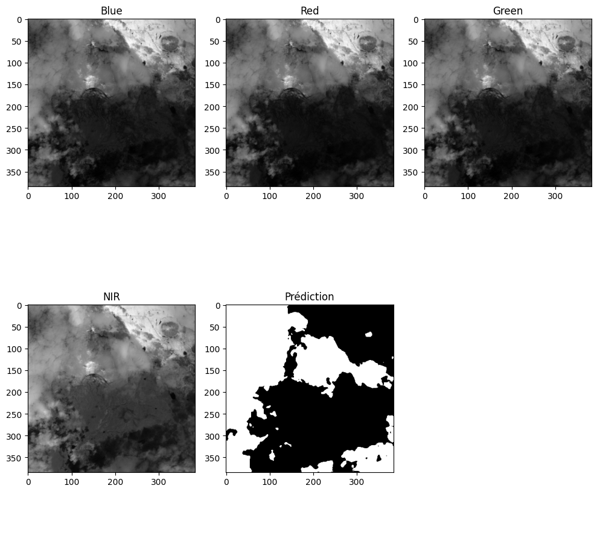
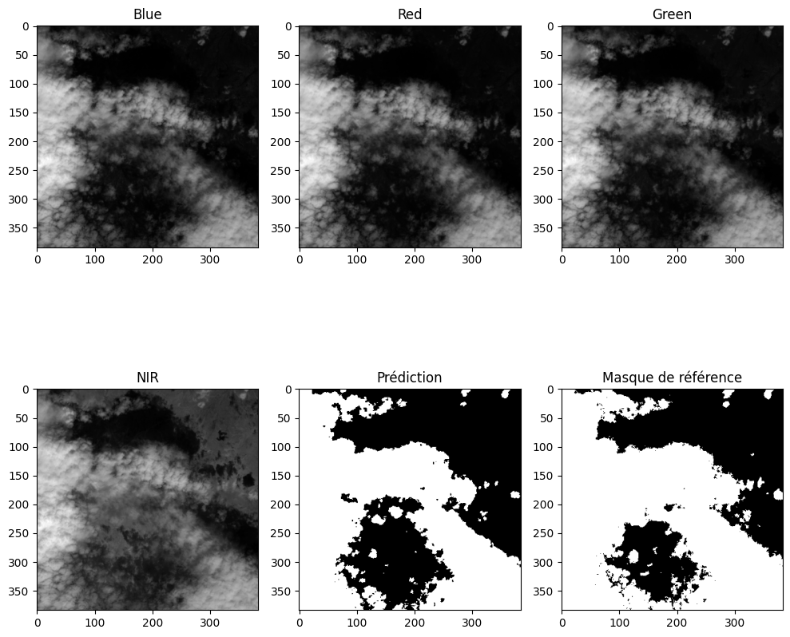
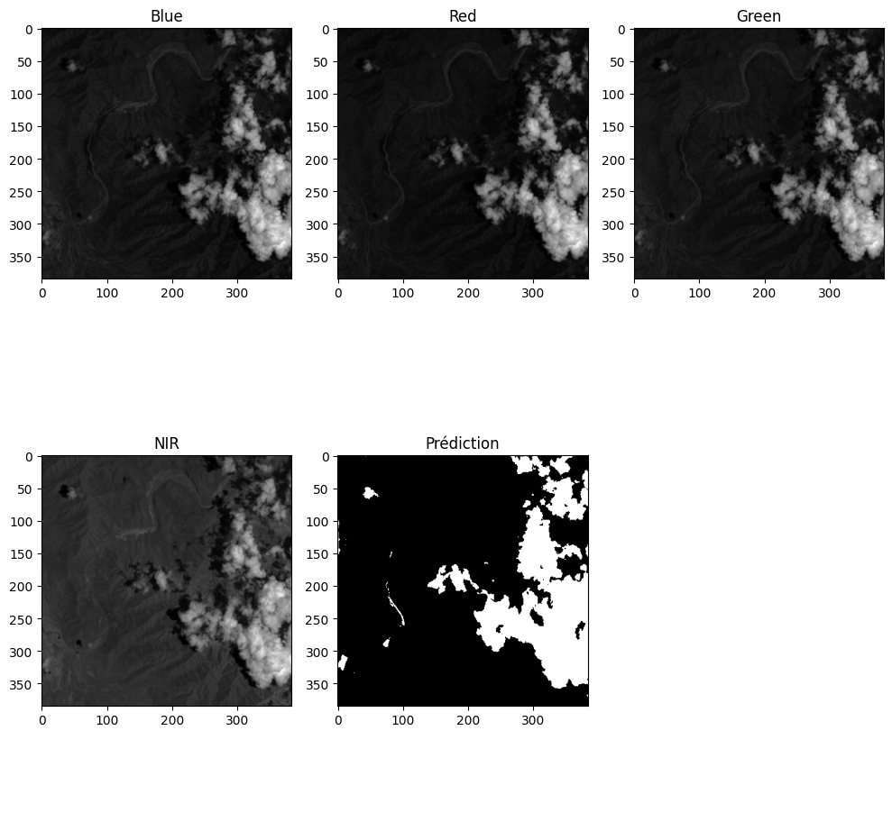
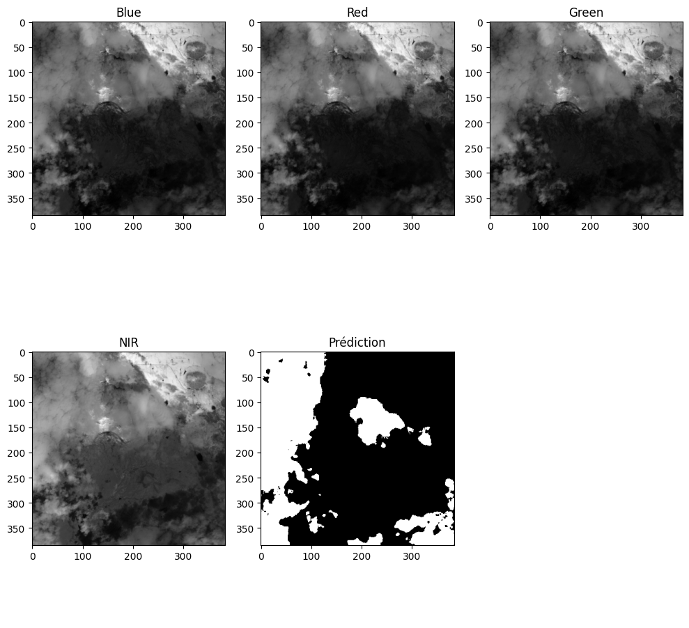
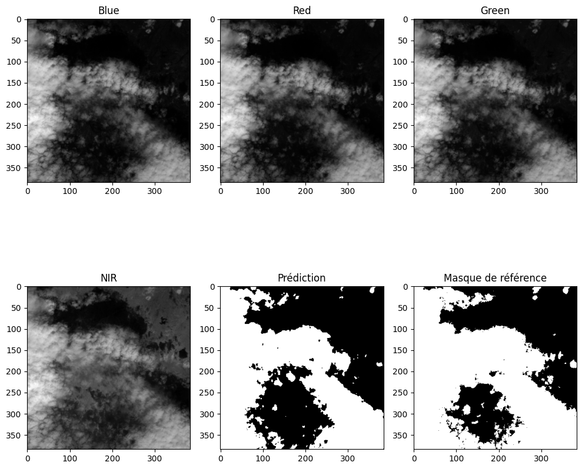
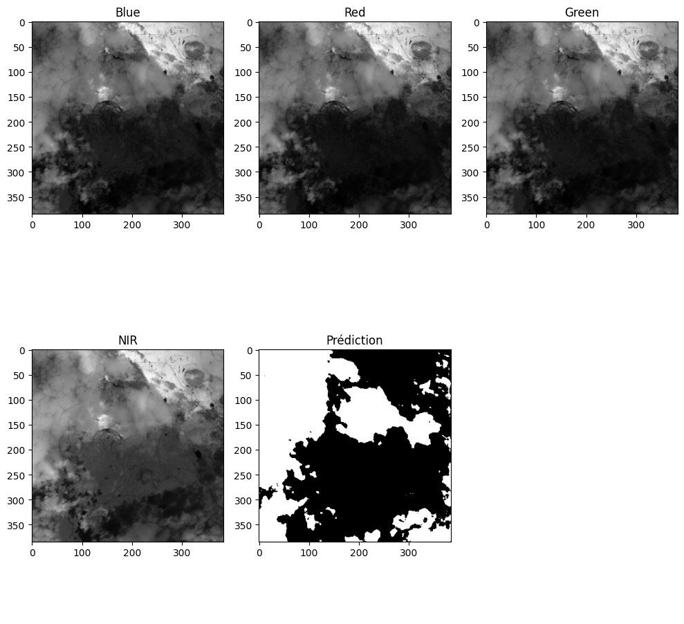
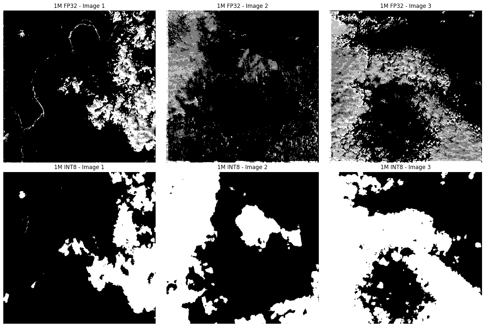

## The purpose of this repo
Here are my tries to reduce, quantize and optimizing a unet network for embedding purpose. The idea behind such a model is to filter which picture should be sent on earth and which picture should be deleted, when doing earth observation.

Through various opportunities, I figured out the cost in terms of link budget and ground station, for communicating between orbit and ground.

## The goal
Make the inference of the model as lightweight as possible through differents steps.

## To-do list
- [x] Having a model that works pretty well
- [x] Optimizing the model
- [ ] Quantize the model
- [ ] Using Rust for inference

## 1 - Having a model that works pretty well

## 2 - Optimizing the model
For the optimization part, I tried to remove some layers in the U-Net. This leads to 4 models, summarized bellow:

|DownSample|Bottleneck|Upsample|BatchNorm|Model size (in parameters)|
|----------|----------|--------|---------|----------|
|4|1|4|No|31M|
|3|1|3|Yes|7M|
|2|1|2|Yes|1M|
|1|1|1|Yes|400k|

And the results are the following:

| |Train|Test 1|Test 2|
|-|-----|------|------|
|31M||||
|7M||||
|1M||||
|400k||||

The results are promising, but the 400k model tent to be unstable in its prediction. The 1M seems to be a good trade-off between size and performance.

## 3 - Quantize the model
For the quantization part, I used the post-training static quantization method from PyTorch. The process involves the following steps:
1. Load the pre-trained model.
2. Prepare the model for quantization by inserting observers.
3. Calibrate the model using a representative dataset to collect statistics for quantization.
4. Convert the model to INT8 format.

But the results are not good. There are some visible "floating point error" as we can see on the following comparison between the FP32 1M model and the INT8 1M model:
