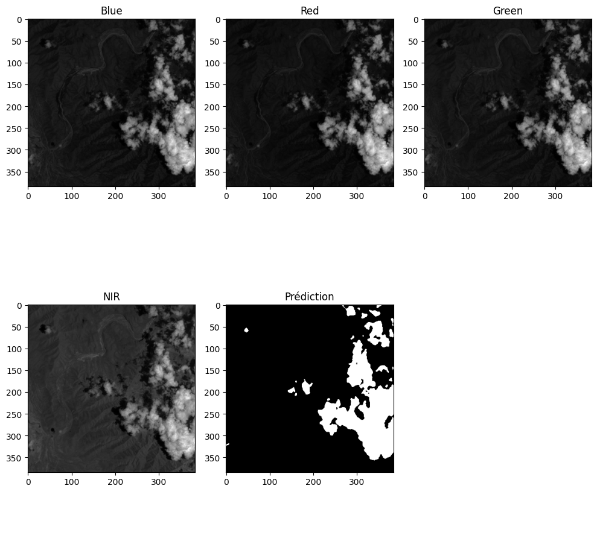
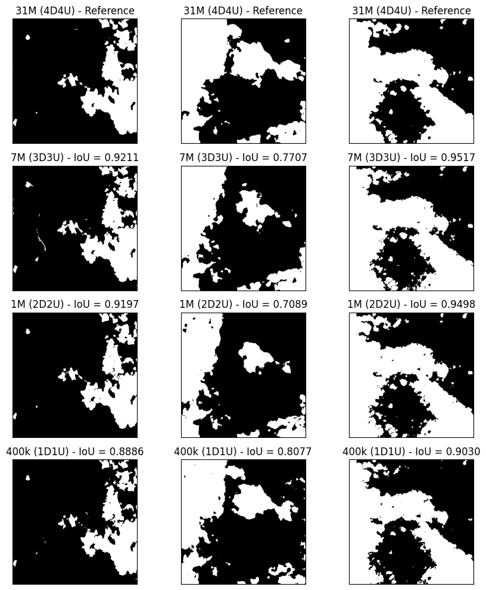
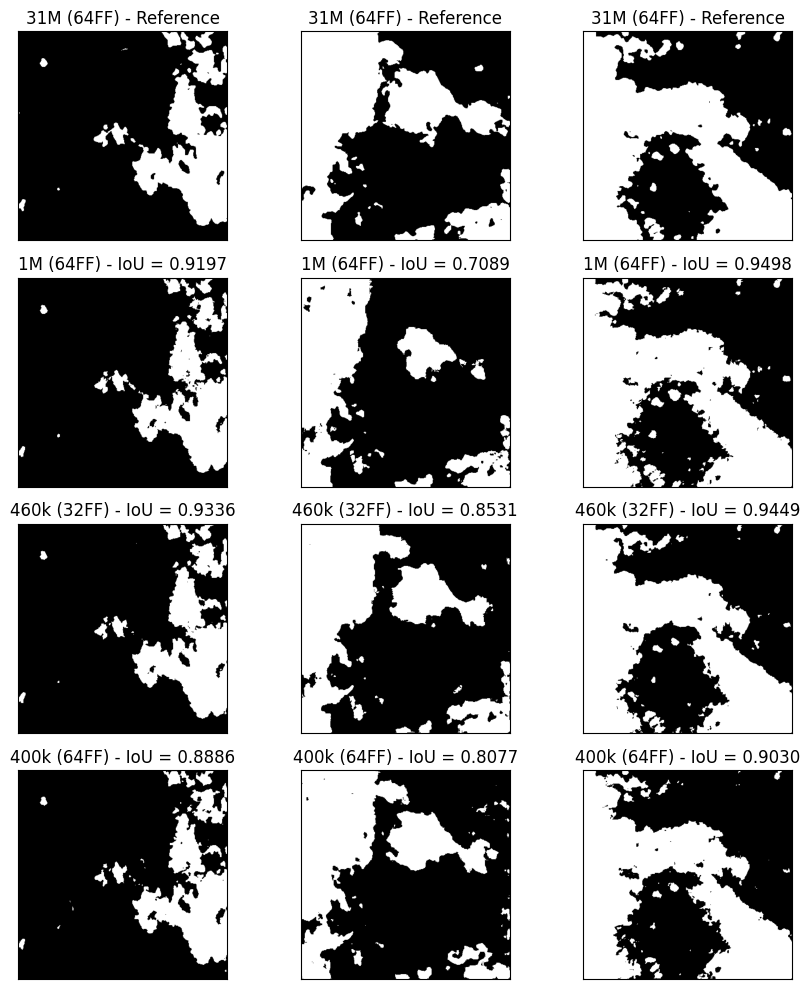
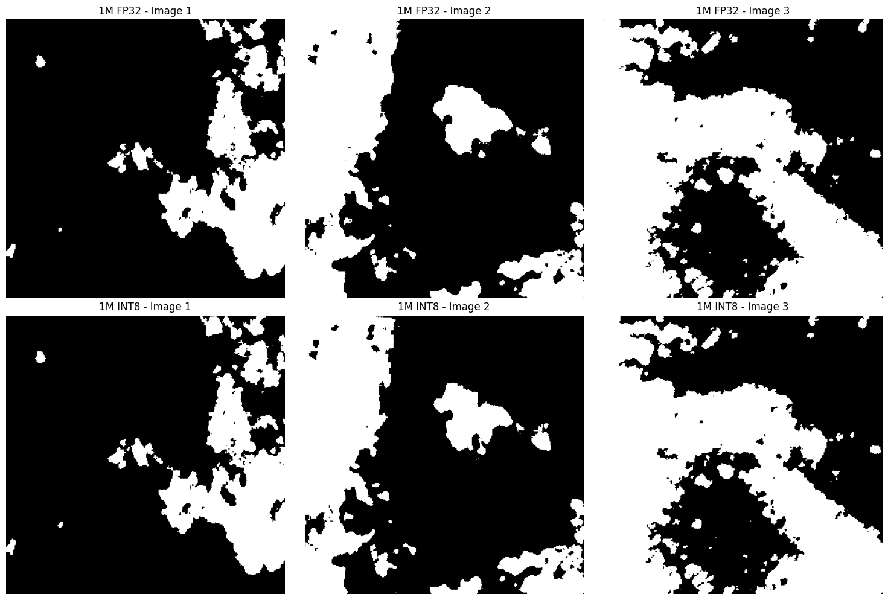
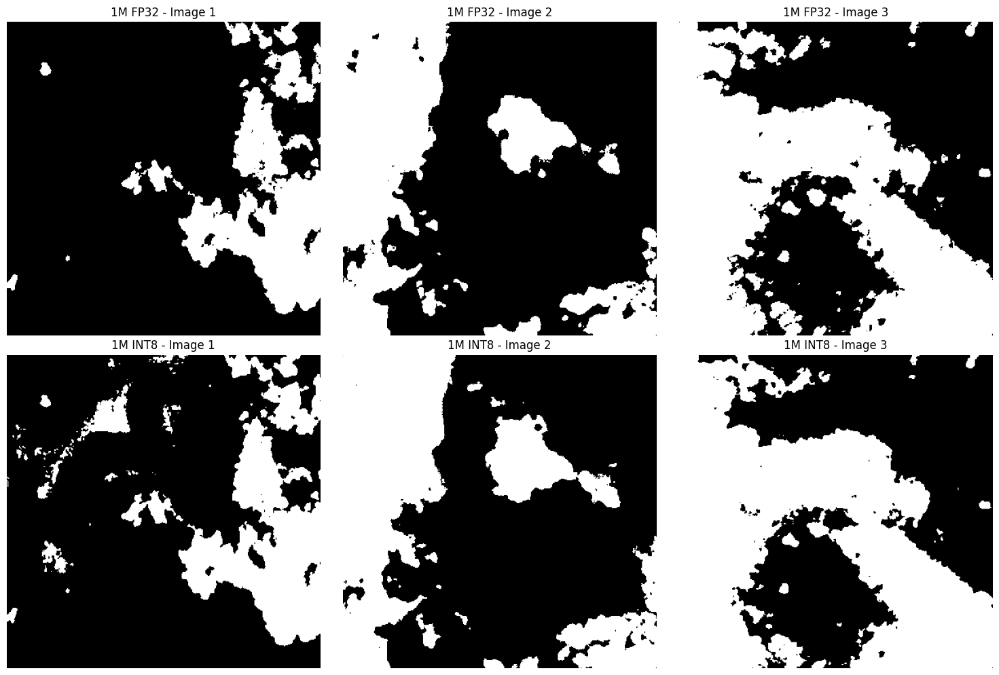
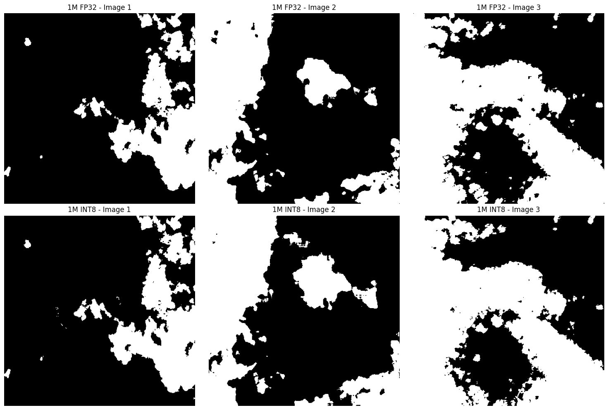
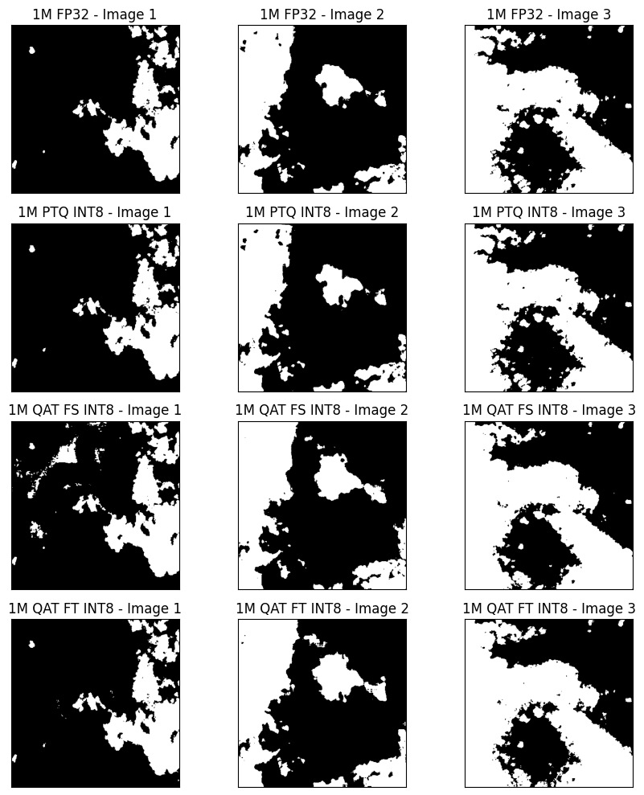
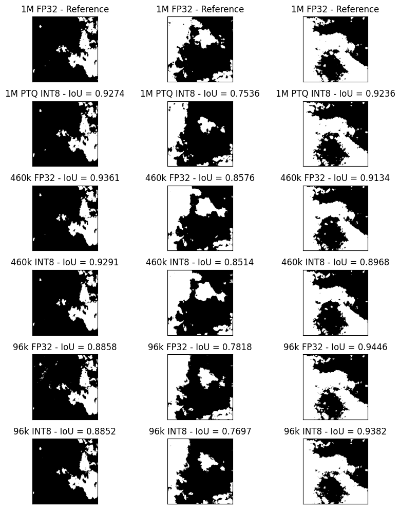

## The purpose of this repo
Here are my tries to reduce, quantize and optimizing a unet network for embedding purpose. The idea behind such a model is to filter which picture should be sent on earth and which picture should be deleted, when doing earth observation.

Through various opportunities, I figured out the cost in terms of link budget and ground station, for communicating between orbit and ground.

## The goal
Make the inference of the model as lightweight as possible through differents steps.

## To-do list
- [x] Having a model that works pretty well
- [x] Optimizing the model
- [x] Quantize the model
- [x] Pushing the limit of optimization
- [ ] Using Rust for inference

### One last thing
Here are the acronyms used in this repo:
- PTQ: Post-training static quantization
- QAT: Quantization-aware training
- FS: From scratch
- FT: Fine-tuning (with pre-trained weights)
- FP32: full precision 32-bit floating point
- INT8: 8-bit integer quantization
- DW: Depthwise separable convolution (reduces the number of parameters and computations)
- ?FF: number of filters in the first layer (e.g. 64 FF = 64 filters in the first layer)
- ?M or ?k: model size in number of parameters (e.g. 1M = 1e6 parameters, 400k = 400e3 parameters)
- ?D?U: number of downsampling and upsampling layers (e.g. 4D4U = 4 downsampling and 4 upsampling layers)
- IoU: Intersection over Union (a metric between 0 and 1, higher is better)
- MACs: Multiply-Accumulate Operations (a measure of computational complexity, lower is better)

## 1 - Having a model that works pretty well

## 2 - Optimizing the model
### Reducing the number of parameters
For the optimization part, I tried to remove some layers in the U-Net. This leads to 4 models all with 1 bottleneck, summarized bellow:

|Architecture|BatchNorm|Parameters|Avg. IoU| MACs | File size|
|------------|---------|----------|--------|------|----------|
|4D4U|No|31M|-|123G|124Mo|
|3D3U|Yes|7M|0.8812|94G|31Mo|
|2D2U|Yes|1M|0.8787|64G|7.5Mo|
|1D1U|Yes|400k|0.8664|35G|1.6Mo|

And the results are the following:

The results are promising, but the 400k model tent to be unstable in its prediction and spot clouds where there are none regardless of the threshold. We rather send useless data than deleting useful data. For the moment, the models are clearly too heavy for MCU inference (35-123G MACs).

### Reducing the initial number of filters
I also tried to reduce the initial number of filters, which is 64 in the original model. I tried with 32 and 16 filters, but the 16 filters produced completly white masks.

The 32 filters (2D2U) model is pretty good, its IoU is better than all the other models, and it is more stable than the 400k model. It also uses only 16GMACs (half of the 400k model), which is pretty good, but still too much for MCU inference. We will keep this model for the quantization part.

### Conclusion of the optimization part
The 1M is a good trade-off between size and performance. 

## 3 - Quantize the model (1M, INT8)
### First try: Post-training static quantization (PTQ)
First, I used the post-training static quantization method from PyTorch. The process involves the following steps:
1. Load the pre-trained model.
2. Prepare the model for quantization by inserting observers.
3. Calibrate the model using a representative dataset to collect statistics for quantization.
4. Convert the model to INT8 format.

The results where surprisingly excellent ! The quantized model is as good as the original model, as it can be seen on the following comparison between the FP32 1M model and the quantized INT8 1M model. 

### Second try: Quantization-aware training (QAT)
I also tried the quantization-aware training method.
The process involves the following steps:
1. Load the pre-trained model.
2. Prepare the model for quantization-aware training by inserting fake quantization modules.
3. Train the model from scratch and with the pre-trained weights
4. Convert the trained model to INT8 format.

The results for the "from scratch" training are not as good as the PTQ method, but still pretty good. The quantized model is slightly worse, specially on the test 1, where it recognize more clouds, but the results are still pretty good. In general, it tends to struggle to draw a clean outline of the clouds.

The results for the "with pre-trained weights" where better, but still not as good as the PTQ method. On the test 2, the model recognize more clouds. We can also see a little bit more noise in the prediction.

### Conclusion of the quantization part
The results are pretty surprising, as the PTQ method is clearly better (best IoU), more stable and easier to implement than the QAT method. Here are my theories:
- The "from scratch" QAT can't be as good as the PTQ method, because during the training, the gradient is not as accurate due to the fake quantization modules.
- The "with pre-trained weights" is not as good as the PTQ method, because the fine-tuning process overfits the model and add some noise in the prediction. I tried with a sixth and a half of the epoch, but it didn't change much the results.

|Model size|Quantization|Type|Avg. IoU|File size|
|----------|------------|----|---|---------|
|1M|-|-|-|7.5Mo|
|1M|PTQ|INT8|0.9726|2Mo|
|1M|QAT|INT8 FS|0.8717|2Mo|
|1M|QAT|INT8 FT|0.9177|2Mo|

## 4 - Pushing the limit of optimization
At this point, I was still not satisfied with the size of the model. I wanted to push the limit of optimization, and see how far I can go while keeping a good performance. I tried to use depthwise separable convolution, which is a technique that reduces the number of parameters and computations by factorizing a standard convolution into a depthwise convolution and a pointwise convolution. This technique is widely used in mobile and embedded models, such as MobileNet.

I hade to rework completely the flow of the training. In this goal, I implemented:
- Dice loss, a IoU-based loss function
- A new training loop, with a scheduler and early stopping
- D4 data augmentation (random horizontal and vertical flip, random rotation)
- I also realized that some of the images in the dataset were completely empty (no data)... So I filtered them out and trained the model only on the non-empty images.

The results were pretty good. With all these optimizations (+ costless PTQ quantization), I was able to train a model with only 96k parameters, an average IoU of 0.8644, 4GMAC and a file size of 0.2Mo. The model is pretty stable (not as good as the 1M model, but still pretty good for its size).

I will export this model to ONNX and try to run it on a MCU.