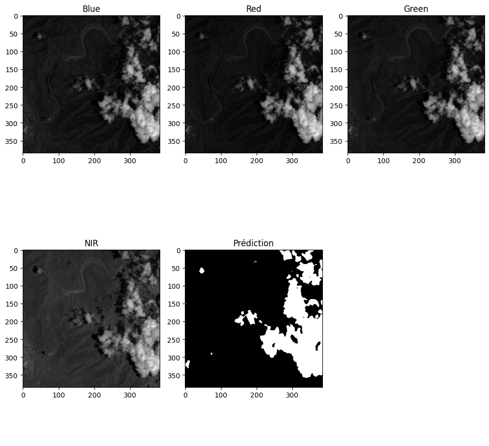

## The purpose of this repo
Here are my tries to reduce, quantize and optimizing a unet network for embedding purpose. The idea behind such a model is to filter which picture should be sent on earth and which picture should be deleted, when doing earth observation.

Through various opportunities, I figured out the cost in terms of link budget and ground station, for communicating between orbit and ground.

## The goal
Make the inference of the model as lightweight as possible through differents steps.

## To-do list
- [x] Having a model that works pretty well
- [ ] Optimizing & Quantize the model
- [ ] Using Rust for inference

## 1 - Having a model that works pretty well
